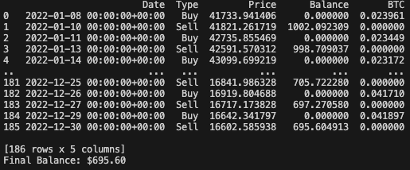

# crypto-trading-simulation

## Strategies

1. Strategy A

while market lose 60%, Strategy A could 95.9% fund!

however, while bull market, it won't earn that much.

2. Strategy B

while market got 156% increase in 2023, Strategy B could have 170% increase.
while market got 60% lose in 2022, strategy B would have only 30.5% lose in 2022.

3. Strategy C

Strategy C can profit even in the bear market, with 4.5% increased;

however, during the bull market, it can earn only 13%, would be prefect for larget fund assets.
