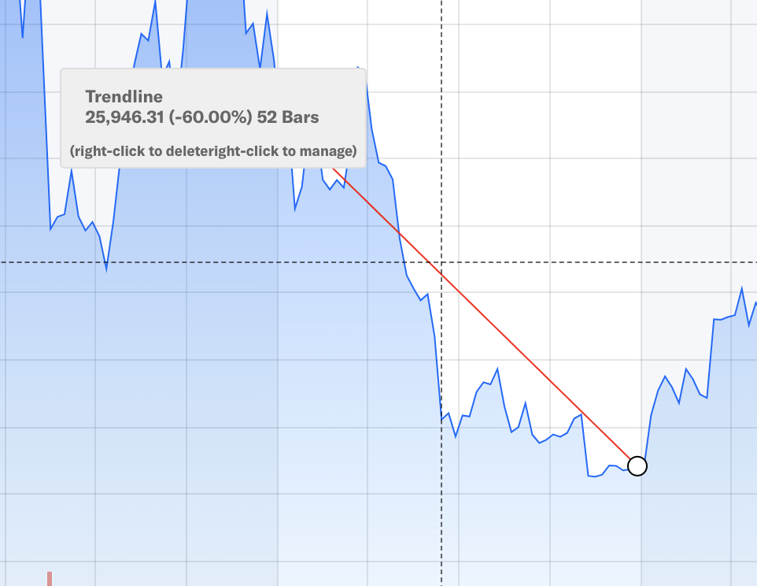
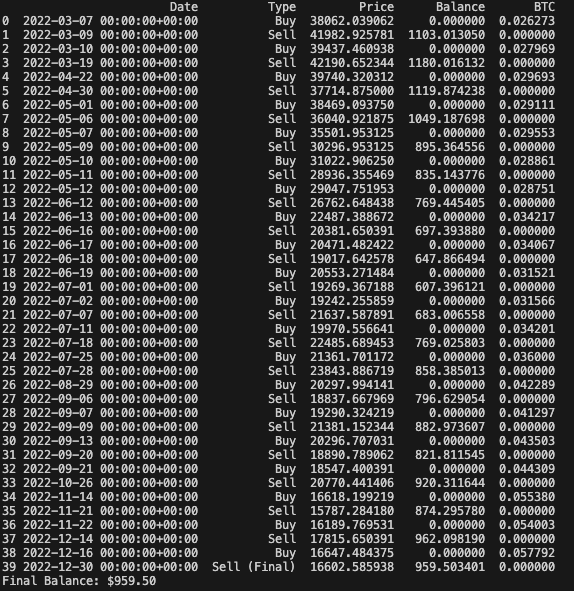
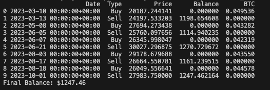
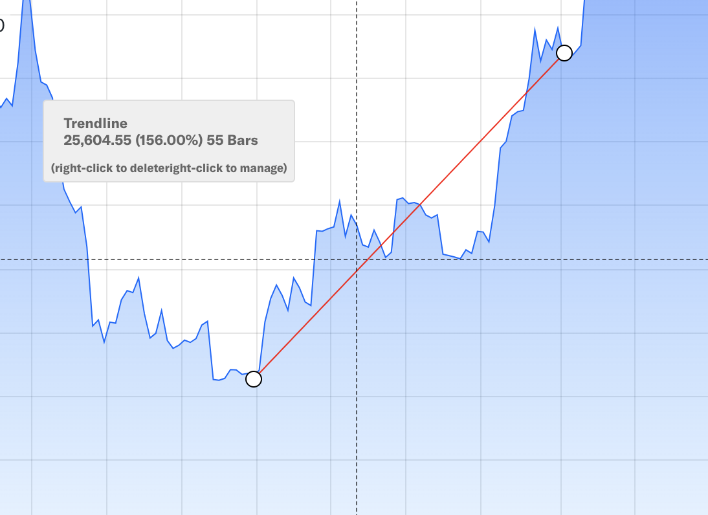

# Crypto Trading Simulation

## Strategies

1. Mean revesion strategy

while market lose 60%, mean_reversion_strategy could 95.9% fund!

however, while bull market, it won't earn that much.

2. Momentum strategy

while market got 156% increase in 2023, momentum strategy could have 170% increase.
while market got 60% lose in 2022, moment strategy would have only 30.5% lose in 2022.