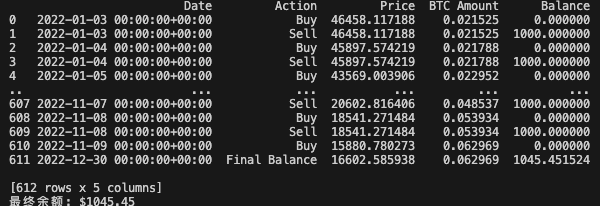
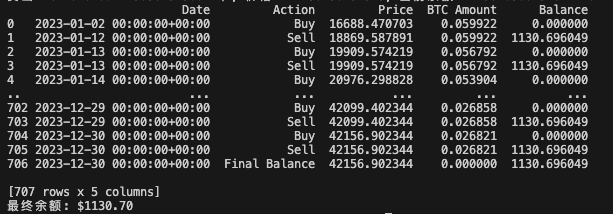

# crypto-trading-simulation

This project simulateted 3 most common strategies in the investment industry.

## Strategies Comparison

1. Strategy A

    

    While market lose 60%, Strategy A could stay with 95.9% of fund!

    

    however, in the bull market, it returns only 24.7% compare with 156% market increase.

    

    The average return would be (-4.1% + 24.7%) = 20.6%, low risk;
    while market average return would be (- 60% + 156%) = 96%, high risk;

2. Strategy B

    

    while market got 156% increase in 2023, Strategy B could have 170% increase.
    while market got 60% lose in 2022, strategy B would have only 30.5% lose in 2022.

    

    The average return would be (-30.5% + 170% ) = 139.5%, Medium risk

3. Strategy C

    

    Strategy C can profit even in the bear market, with 4.5% increased;

    

    however, during the bull market, it can earn only 13%, would be prefect for
    larget fund assets.

    The average return would be (4.5% + 13%) = 17.5%, low risk
